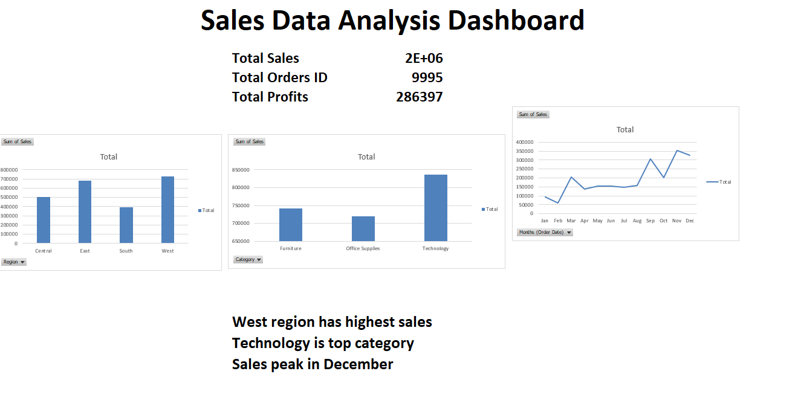

Sales Data Analysis Dashboard (Excel)

This project demonstrates data analysis and business intelligence using Excel.

🎯 Objective

Built an Excel-based sales dashboard to analyze business performance and identify key revenue trends across regions, categories, and time periods.

🎯 What I did
I analyzed sales data using Excel and made a dashboard.

🛠 Tools used
Excel
Charts
Pivot Tables

📊 What is inside
Sales by Region
Sales by Category
Sales Trend
Total Sales, Orders, Profit

🔍 Result
I found insights about sales performance using charts.

## 📈 Key KPIs
- Total Sales
- Total Orders
- Total Profit

## 🔍 Insights
📊 Key Insights
-West region contributes the highest sales share (~38%)
-Technology category is the top revenue generator
-Sales show peak during year-end months

## 📷 Dashboard Preview

